<div align="center">

# InvoiceGen

### Create invoices. Get paid.

[](https://nextjs.org)
[](https://www.typescriptlang.org)
[](https://github.com/WiseLibs/better-sqlite3)
[](https://tailwindcss.com)



</div>

---

## Why InvoiceGen?

Most invoice tools are either bloated SaaS products that cost $30/mo for features you never use, or ugly open-source projects that look like they were built in 2008. InvoiceGen is neither.

It's a self-hosted, zero-dependency invoice generator that lives in your repo, stores data in a single SQLite file, and looks like it was designed by Stripe. No accounts. No subscriptions. No cloud.

---

## Features

- **Create & edit invoices** — client details, line items (qty × unit price), due date, notes
- **PDF export** — clean print-CSS layout, one click to Save as PDF from any browser
- **Invoice list** — sortable table with status filtering and quick actions
- **Dashboard KPIs** — total invoiced, paid, outstanding, draft count
- **Status workflow** — Draft → Sent → Paid, with one-click toggles
- **Auto invoice numbering** — `INV-2026-0001` format, auto-incrementing per year
- **Stripe-inspired design** — light typography, blue-tinted shadows, `#533afd` purple accent

---

## Quick Start

```bash
git clone https://github.com/mariotavarez/invoice-gen.git
cd invoice-gen
npm install
npm run dev
```

Open [http://localhost:3000](http://localhost:3000).

The SQLite database is created automatically at `data/invoices.db` on first run.

---

## How It Works

1. **Create an invoice** at `/invoices/new` — fill in client info and add line items
2. **Review & manage** at `/invoices/[id]` — view details, change status, edit
3. **Print / PDF** at `/invoices/[id]/preview` — print-optimized layout, browser "Save as PDF"
4. **Track everything** on the dashboard — stats update in real-time via Server Components

All mutations happen through **Next.js Server Actions** — no API routes, no client-side fetch calls. The SQLite database is a single file you can back up with `cp`.

---

## Tech Stack

| Layer | Technology |
|---|---|
| Framework | Next.js 15 (App Router, Server Actions) |
| Language | TypeScript 5.7 strict |
| Styling | Tailwind CSS v4 |
| Database | SQLite via `better-sqlite3` |
| ID generation | `nanoid` |
| Icons | `lucide-react` |
| Font | Inter (Google Fonts) |

---

## Project Structure

```
app/
├── page.tsx                  # Dashboard
├── invoices/
│   ├── page.tsx              # All invoices
│   ├── new/page.tsx          # Create form
│   └── [id]/
│       ├── page.tsx          # Detail + edit
│       └── preview/page.tsx  # Printable preview
components/
├── InvoiceForm.tsx           # Client + line items form
├── InvoiceTable.tsx          # Sortable table
├── PrintableInvoice.tsx      # Print layout
├── StatusBadge.tsx           # Draft/Sent/Paid badge
└── StatsCard.tsx             # KPI card
lib/
├── db.ts                     # SQLite singleton + queries
├── actions.ts                # Server Actions
└── utils.ts                  # formatCurrency, formatDate
```

---

## License

MIT — use it however you like.
